<div align="center">
<table>
    <theader>
        <tr>
            <th></th>
            <th>
                <span style="font-weight:bold;">UNIVERSIDAD LA SALLE</span><br />
                <span style="font-weight:bold;">FACULTAD DE INGENIERÍAS</span><br />
                <span style="font-weight:bold;">DEPARTAMENTO DE INGENIERÍA Y MATEMÁTICAS</span><br />
                <span style="font-weight:bold;">CARRERA PROFESIONAL DE INGENIERÍA DE SOFTWARE</span>
            </th>            
        </tr>
    </theader>
    
</table>
</div>

<div align="center">
<span style="font-weight:bold;">Kubernetes en Windows con contenedores Docker Desktop</span><br />
</div>

<table>
    <theader>
        <tr><th colspan="2">INFORMACIÓN BÁSICA</th></tr>
    </theader>
<tbody>

<tr><td>TÍTULO DEl DOCUMENTO:</td><td>Kubernetes en Windows con contenedores Docker Desktop</td></tr>
<tr><td colspan="2">RECURSOS:
    <ul>
        <li><a href="https://www.docker.com/">Sitio oficial del Proyecto Docker</a></li>
        <li><a href="https://kubernetes.io/docs/tutorials/kubernetes-basics/create-cluster/cluster-interactive/">Tutorial Interactivo Kubernetes</a></li>
        <li><a href="https://www.enmilocalfunciona.io/instalando-y-probando-kubernetes-windows-10/</a>Instalando Kubernetes en windows 10</a></li>
        <li><a href="https://hub.docker.com">Docker Hub</a> </li>
        <li><a href="https://docs.microsoft.com/en-us/visualstudio/docker/tutorials/docker-tutorial">Crear un Docker en Visual Studio Code</a></li>


</ul>
        
</td>
</<tr>
<tr><td colspan="2">Alumno:
    <ul>
        <li>Augusto Delgado Bravo -- adelgadob@ulasalle.edu.pe</li>
    </ul>
</td>
</<tr>
</tdbody>
</table>

# DOCKER

#

## OBJETIVOS Y TEMAS

### OBJETIVOS
- Aprender a desplegar contenedores con Docker y crear un cluster que maneje contenedores en Kubernetes.

### TEMAS
- Docker en windows.
- Docker vs VMs
- Comandos en Docker
- Kubernetes en windows 
- Comandos en Kubernetes
 

## CONTENIDO DE LA GUÍA

### MARCO CONCEPTUAL

#### Docker en windows 10

##### Que es Docker

-   Docker es un proyecto de código abierto, su principal función es poder crear contenedores ligeros y portables para las aplicaciones de Software y estas puedan ser ejecutadas en cualquier maquina con Docker instalado, sin importa el sistema operativo que este instalado en el ordenador físico que contenga dentro de si el software de Docker.
-   Creado por Solomon Hykes en dotCloud <- Cloudlets. Liberado en marzo del 2013.
-   Crea contenedores livianos de software virtualizados en diferentes Sistemas Operativos.
-   Permite la ejecución de contenedores independientes.
-   Reduce la sobrecarga y el mantenimiento en comparación con las máquinas virtuales tradicionales.
-   Permite empaquetar una aplicación y sus dependencias en un contenedor virtual.
-   Permite la flexibilidad, portabilidad y la ejecución en cualquier medio compatible.

### Diferencias entre Docker y una Máquina Virtual (VM)

-   Docker no necesita crear sistemas operativos independientes.
-   Con Docker se construye sólo una vez y se ejecuta en cualquier lugar. Leer: [Docker: A 'Shipping Container' for Linux Code][Docker: A 'Shipping Container' for Linux Code]
-   Docker utiliza funcionalidades del kernel aislando recursos (CPU, Memoria, E/S, Net, etc.)
-   Docker simplifica la creación de Sistemas Distribuidos.
-   Docker es PaaS (Plataforma como servicio).
-   Docker se puede integrar facilmente con AWS, GCP, DO, MA, RHOS, etc.


    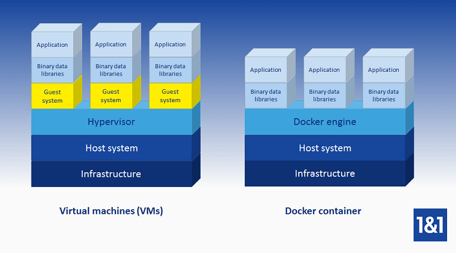 
    -   Fuente: [Tutorial de Docker: instalar y gestionar la plataforma de contenedores]


- Arquitectura de Docker  

    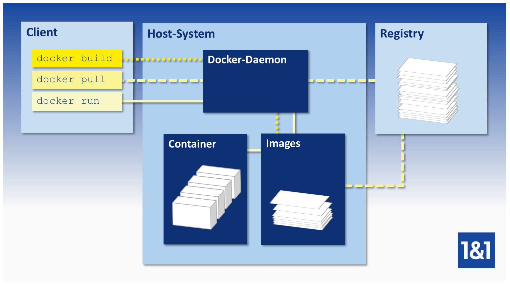


### Imágenes/Contenedores en Docker

-   Son administradas por Docker-Daemon.
-   Las imágenes de Docker pueden ser creadas por el usuario a traves de la terminal.
-   La imágenes son plantillas de sólo lectura que tiene instrucciones que utiliza el motor de Docker paa crear un contenedor.
-   Una imágen se describen en un archivo de texto llamado Dockerfile.
-   Antes de iniciar un contenedor se carga un paquete con la imagen correspondiente.
-   Un contenedor es un proceso en ejecución de una imagen.


### Docker Hub

-   Es el Resgistro.
-   Es un repositorio de imágenes de Docker basado en la nube.
-   Es una biblioteca para imágenes Docker.
-   Es un servicio online que tiene repositorios (Publicos y privadod). Similar a GitHub.
-   URL de Docker Hub: [https://hub.docker.com/][Docker-Hub]


### Comandos Docker

-   Crear una imagen. Puede existir Dockerfile para esa imagen. (Local)
    ```sh
    docker build
    ```

-   Descargar una imagen de Docker Hub. (Remoto)
    ```sh
    docker pull
    ```

-   Iniciar un contenedor. (Local/Remoto)
    ```sh
    docker run
    ```

### Instalar el Motor Docker

#### Requerimientos del sistema

- Windows 11 de 64 bits: Home o Pro versión 21H2 o superior, o Enterprise o Education versión 21H2 o superior.
- Windows 10 64 bits: Home o Pro 21H1 (build 19043) o superior, o Enterprise o Education 20H2 (build 19042) o superior.
- Habilite la función WSL 2 en Windows. Para obtener instrucciones detalladas, consulte la documentación de Microsoft.
- Usar arquitectura 64 bits.
- Los siguientes requisitos de hardware son necesarios para ejecutar correctamente WSL 2 en Windows 10 o Windows 11:
    - Procesador de 64 bits con traducción de direcciones de segundo nivel (SLAT)
    - 4 GB de RAM del sistema
    - El soporte de virtualización de hardware a nivel de la BIOS debe estar habilitado en la configuración de la BIOS. Para más información, consulte Virtualización.
   
### Instalar Docker Desktop en Windows

#### Instalación Interactiva
- Haga doble clic en Docker Desktop Installer.exe para ejecutar el instalador.

- Si aún no ha descargado el instalador (Docker Desktop Installer.exe), puede obtenerlo en Docker Hub. Normalmente se descarga en tu carpeta de descargas, o puedes ejecutarlo desde la barra de descargas recientes en la parte inferior de tu navegador web.

- Cuando se le solicite, asegúrese de que la opción Usar WSL 2 en lugar de Hyper-V en la página de Configuración esté seleccionada o no, dependiendo de su elección de backend.

- Si su sistema sólo soporta una de las dos opciones, no podrá seleccionar qué backend utilizar.

- Siga las instrucciones del asistente de instalación para autorizar el instalador y proceder a la instalación.

- Cuando la instalación se realice correctamente, haga clic en Cerrar para completar el proceso de instalación.

- Si su cuenta de administrador es diferente a su cuenta de usuario, debe añadir el usuario al grupo docker-users. Ejecute Administración de equipos como administrador y vaya a Usuarios y grupos locales > Grupos > docker-users. Haz clic con el botón derecho del ratón para añadir el usuario al grupo. Cierre la sesión y vuelva a iniciarla para que los cambios surtan efecto.

#### Instalación Via Comandos

- En PowerShell ejecutar el siguiente comando:
  - ```sh
                  Start-Process '.\win\build\Docker Desktop Installer.exe' -Wait install
    
  - Si usa Windows Command Prompt:
    - ```sh
                Start /w "" "Docker Desktop Installer.exe" install

  - 


### Iniciar Docker Desktop

- Busque Docker y seleccione Docker Desktop en los resultados de la búsqueda.


- El menú de Docker (menú de la ballena) muestra la ventana del Acuerdo de Servicio de Suscripción de Docker. Incluye un cambio en las condiciones de uso de Docker Desktop. 

### Iniciando Docker Desktop

- Cuando la inicialización está completa, Docker Desktop lanza la Guía de Inicio Rápido. Este tutorial incluye un sencillo ejercicio para construir una imagen Docker de ejemplo, ejecutarla como contenedor, empujar y guardar la imagen en Docker Hub.

- Para ejecutar la Guía de inicio rápido bajo demanda, haga clic con el botón derecho del ratón en el icono de Docker en el área de notificaciones (o en la bandeja del sistema) para abrir el menú de Docker Desktop y, a continuación, seleccione Guía de inicio rápido.


### Usar comandos docker

-   Opciones, comandos y argumentos
    ```sh
    docker [option] [command] [arguments]
    docker
    docker info
    docker images --help
    docker ps --help
    docker rm --help
    ```

-   Los contenedores de Docker se construyen con imágenes de Docker Hub(Por defecto).
    ```sh
    docker run hello-world
    ```
    ```sh
    Unable to find image 'hello-world:latest' locally
    latest: Pulling from library/hello-world
    2db29710123e: Pull complete 
    Digest: sha256:80f31da1ac7b312ba29d65080fddf797dd76acfb870e677f390d5acba9741b17
    Status: Downloaded newer image for hello-world:latest

    Hello from Docker!
    ```

-   buscar imágenes disponibles en Docker Hub
    ```sh
    docker search ubuntu
    ```

-   Descargar la imagen oficial de ubuntu a su ordenador:
    ```sh
    docker pull ubuntu
    ```

-   Ejecutemos un contenedor usando la imagen más reciente de Ubuntu
    ```sh
    docker run -it ubuntu
    
    root@c25d89d863b2:/#
    ```

-   Trabaja dentro del contenedor
    ```sh
    root@c25d89d863b2:/# apt-get update
    root@c25d89d863b2:/# apt-get install apache2
    root@c25d89d863b2:/# /etc/init.d/apache2 status
    root@c25d89d863b2:/# /etc/init.d/apache2 start
    root@c25d89d863b2:/# /etc/init.d/apache2 status
    root@c25d89d863b2:/# exit
    ```

-   Administrar contenedores de Docker
    ```sh
    docker ps
    docker ps -a
    docker ps -l
    docker start -i c25d89d863b2
    ```


## KUBERNETES
- Kubernetes es una plataforma de orquestación de contenedores de código abierto diseñada para automatizar el despliegue, el escalado y la gestión de aplicaciones en contenedores. De hecho, Kubernetes se ha establecido como el estándar de facto para la orquestación de contenedores.

- Kubernetes facilita el despliegue y la explotación de aplicaciones en una arquitectura de microservicios. Para hacer esto, se crea una capa de abstracción sobre un grupo de hosts, de modo que los equipos de desarrollo pueden desplegar sus aplicaciones y dejar que esta tecnología gestione actividades como:

    - Controlar el consumo de recursos por aplicación o equipo.
    - Repartir uniformemente la carga de las aplicaciones en una infraestructura de hosts.
    - Equilibrar automáticamente las solicitudes de carga entre las diferentes instancias de una aplicación.
    - Supervisar el consumo de recursos y los límites de recursos para impedir automáticamente que las aplicaciones consuman demasiados recursos.
    - Mover una instancia de aplicación de un host a otro si hay escasez de recursos en un host, o si el host muere.
    - Aprovechar automáticamente los recursos adicionales disponibles cuando se añade un nuevo host al clúster.
    - Realizar fácilmente despliegues y retrocesos canario. Estos despliegues se llaman así en alusión a los canarios que utilizaban los mineros antiguamente para detectar fugas de gas bajo tierra. En este contexto, el despliegue canario permite observar el impacto de un despliegue con un bajo impacto en los usuarios.


## Instalando y probando Kubernetes en Windows 10

### Requerimientos Previos

- Windows 10 Professional o superior.
- Hyper-V activado en Windows 10.
- Docker 18.02 en adelante para Windows.
- Conocimientos básicos de PowerShell, Docker y Kubernetes.

### Instalando Kubernetes desde Docker

- Por defecto, Kubernetes está desactivado y el proceso de instalación se realiza desde la propia interfaz de configuración de Docker que vemos aquí:

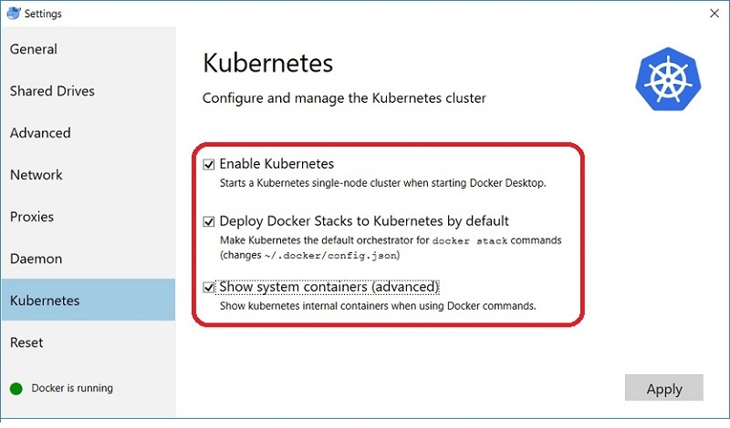

- Una vez seleccionamos las opciones, pulsamos Apply y nos aparece una ventana de diálogo para confirmar la instalación de Kubernetes en nuestro PC:

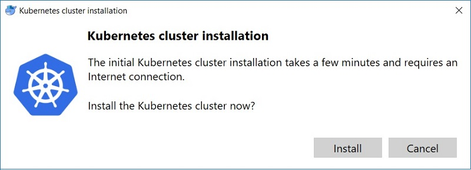

- Pulsamos Install y en unos minutos tendremos la instalación finalizada de un servidor Kubernetes con un clúster de un solo nodo, ya configurado y listo para usar.

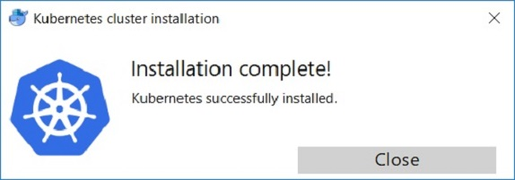


### Kubectl y comandos útiles

- Para trabajar con Kubernetes, tenemos la herramienta de línea de comandos kubectl, que sirve para arrancar, controlar, inspeccionar, gestionar, desplegar y escalar aplicaciones en el clúster y queda instalada de forma automática en el proceso anterior.

- Usando kubectl desde PowerShell, accedemos a todos los recursos de Kubernetes mediante una serie de comandos que debemos conocer previamente. Estos son algunos ejemplos que utilizamos normalmente:

### Obtener información y diagnóstico:

 ```sh
 
kubectl version  
kubectl cluster-info  
kubectl get componentstatuses  

 ```

### Obtener nodos, pods, deployments y services:

```sh
kubectl get all  
kubectl get nodes -o wide  
kubectl get rc -o wide  
kubectl get pods -o wide  
kubectl get pods -n kube-system  
kubectl get deployments -o wide  
kubectl get services -o wide  

```

### Para el resto de comandos aquí tenéis un enlace a cursos de Kubernetes y una super-chuleta ofrecida por la Linux Academy:

kubernetes-cheatsheet.png

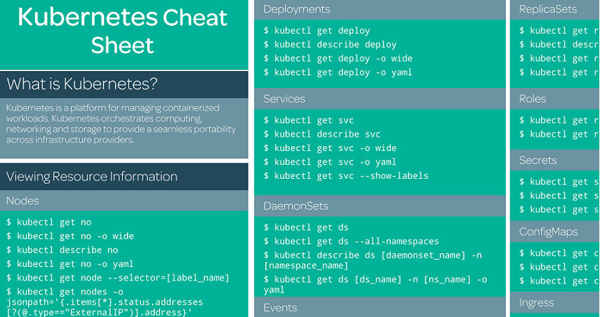


## Contexto Docker y Kubernetes

- Un punto importante para no tener problemas al usar Kubernetes en nuestro PC, trata sobre configurar el contexto de “docker-for-desktop” para nuestro entorno local. Normalmente queda configurado, pero a veces he encontrado escenarios donde hay que hacerlo desde kubectl.

- Para ver el nodo de Docker en Kubernetes, ejecutamos desde PowerShell:

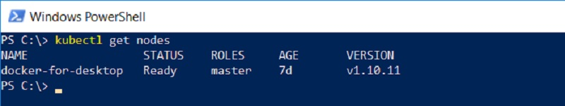

- Para consultar el contexto, ejecutar este comando desde PowerShell:

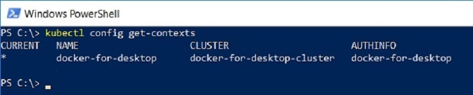

- Para configurarlo, ejecutamos este comando desde PowerShell:


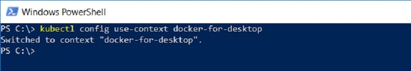

- Una vez configurado correctamente ya podemos continuar.

### Dashboard de Kubernetes

- Kubernetes también dispone de un Dashboard muy útil para consultar y gestionar el funcionamiento del clúster, que no viene instalado de forma predeterminada.

- Activarlo en Windows 10, necesita algunos pasos, empezando por hacer un deploy desde PowerShell:

```sh
kubectl apply -f https://raw.githubusercontent.com/kubernetes/dashboard/v1.10.1/src/deploy/recommended/kubernetes-dashboard.yaml  
```
- Para confirmar que se ha instalado correctamente veremos esto en la consola:

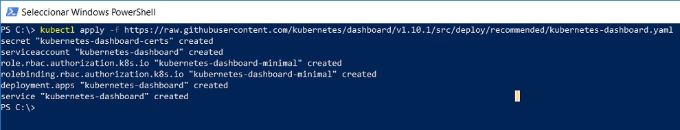

- Una vez creado, necesitamos ejecutar el comando: kubectl proxy

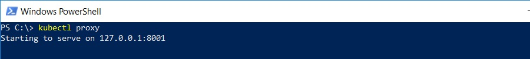

- Abrimos un navegador, vamos a las URL http://localhost:8001 y http://localhost:8001/ui, pero veremos que no aparece y devuelve JSON en lugar del Dashboard. Eso es porque todavía nos falta crear y seleccionar el kubeconfig file.

- Accedemos a esta URL para activar el Dashboard: http://localhost:8001/api/v1/namespaces/kube-system/services/https:kubernetes-dashboard:/proxy

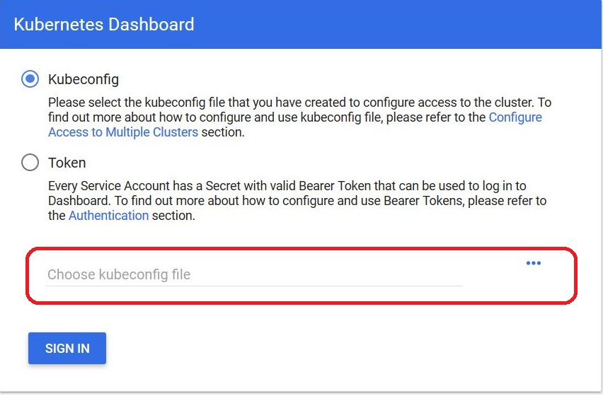

- Ejecutar estos comandos, desde otra ventana PowerShell para nuestro usuario:

```sh

PS> $TOKEN=((kubectl -n kube-system describe secret default | Select-String "token:") -split " +")[1]

PS> kubectl config set-credentials docker-for-desktop --token="${TOKEN}"  

```
- Veremos que se crea la carpeta ".kube" y el fichero "config", que encontramos dentro de la carpeta c:\users\:

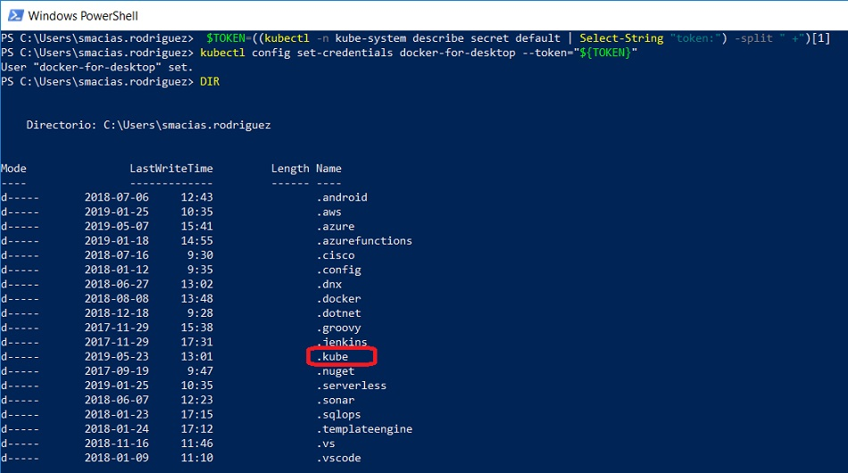

- Seleccionamos dentro de ".kube" el fichero "config" en el dialogo de la interfaz web, pulsamos SIGN IN y aparecerá el panel de Kubernetes como se muestra en la imagen.

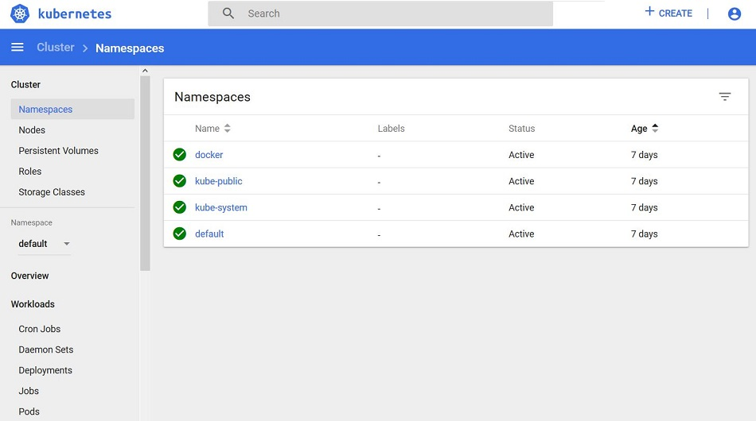

- Ahora sí, ya tenemos el Dashboard operativo, y aunque no hemos desplegado nada todavía, nos facilitará información sobre el estado de los recursos del clúster y cualquier error que pueda ocurrir.

### Desplegando Aplicaciones

- Como último paso, desplegaremos una aplicación ASP.NET Core utilizando las imágenes que ofrece Microsoft en Docker Hub: https://hub.docker.com/_/microsoft-dotnet-core

- Primero la ejecutamos desde Docker mediante el siguiente comando:
- 
```sh

docker run --name aspnetcore_sample --rm -it -p 8000:80 mcr.microsoft.com/dotnet/core/samples:aspnetapp  

```

- Una vez creado el contenedor, abrimos un navegador en  http://localhost:8000 para verla funcionando:

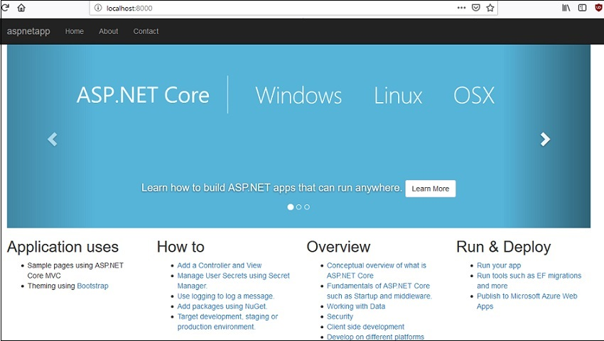

- Detenemos el contenedor, hacemos lo mismo mediante kubectl para Kubernetes, lanzamos los siguientes comandos para desplegar 3 réplicas y exponemos una dirección IP externa para acceder a nuestra aplicación "aspnetapp" en el clúster:

```sh
kubectl run aspnetapp --image=mcr.microsoft.com/dotnet/core/samples:aspnetapp --port=80 --replicas=3  
kubectl expose deployment aspnetapp --type=NodePort  

```

- Comprobamos que "aspnetapp" ha sido creado correctamente:


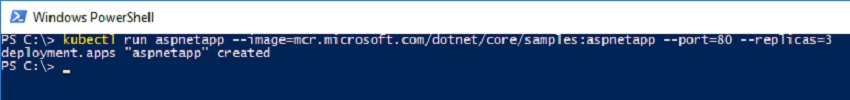


- Ya tenemos el despliegue realizado en Kubernetes. Ahora verificamos el resultado mediante el comando: kubectl get all para ver  que se han creado las 3 réplicas y el puerto expuesto para acceder a nuestra aplicación web:


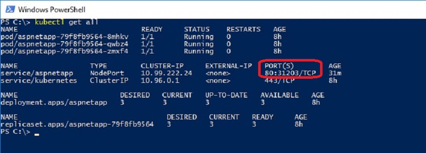

- Si navegamos a http://localhost:31203 tendremos la aplicación web funcionando:

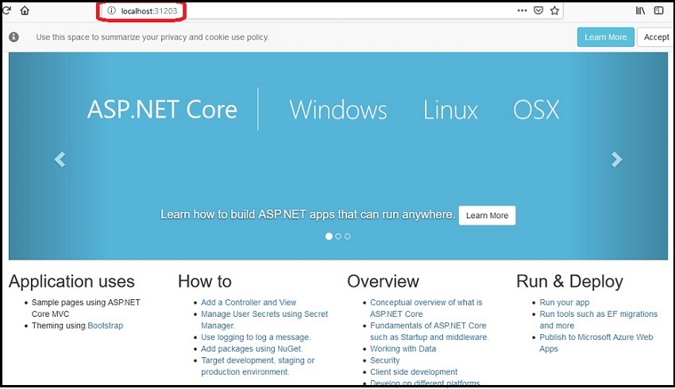

#

## REFERENCIAS
- [Sitio oficial del Proyecto Docker][Docker-site]
- [Sitio Oficial de Kubernetes][Moby-Github]
- [Interactive Tutorial - Creating a Cluster][Containers-PDF]
- [Hub Docker][Joomla-MySQL]
- [Tutorial de Docker en Windows ][Docker-Tutorial-Youtube]
- [Instalar Kubernetes][Cómo instalar y usar Docker en Ubuntu 20.04]
- [Instalar Kubernetes][Cómo instalar y usar Docker en Ubuntu 20.04]
- [Mini Kube][mini-kube] 

#


[Docker-site]: https://www.docker.com/
[Moby-Github]: https://kubernetes.io
[Containers-PDF]: https://kubernetes.io/docs/tutorials/kubernetes-basics/create-cluster/cluster-interactive/
[Joomla-MySQL]: https://hub.docker.com
[Docker-Tutorial-Youtube]: https://docs.docker.com/desktop/windows/install/
[mini-kube]: https://minikube.sigs.k8s.io/docs/start/

[Docker: A 'Shipping Container' for Linux Code]: https://web.archive.org/web/20130808043357/http://www.linux.com/news/enterprise/cloud-computing/731454-docker-a-shipping-container-for-linux-code/
[Tutorial de Docker: instalar y gestionar la plataforma de contenedores]: https://www.ionos.es/digitalguide/servidores/configuracion/tutorial-docker-instalacion-y-primeros-pasos/

[Docker-Hub]: https://hub.docker.com/

[Cómo instalar y usar Docker en Ubuntu 20.04]:https://www.enmilocalfunciona.io/instalando-y-probando-kubernetes-windows-10/


